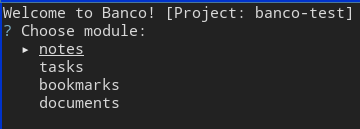
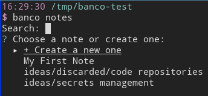
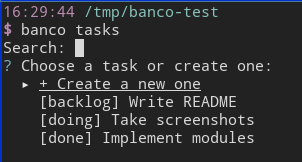
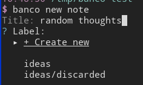
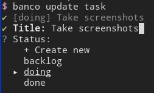

# Banco

Banco Management System, or simply **Banco**, is an opinionated project management tool for the command line that helps you **organize notes, tasks, bookmarks and documents** for your projects.

Banco objects _(notes, tasks, bookmarks, etc)_ are stored in the **filesystem**, implemented as plain text files and folders within the root of the project, so you won't need to install or run any database or server. This enables you to easily create archives and backups, move projects around the filesystem, use command line tools, or keep track of changes by using version control. 

The name "Banco" is a tribute to [Banco Del Mutuo Soccorso](http://www.progarchives.com/artist.asp?id=36), the best italian progressive rock band of all times.


## Installation

You can install Banco with Go:
```sh
go get github.com/claudiodangelis/banco
```

or by downloading the latest [binary release](https://github.com/claudiodangelis/banco/releases).

## Configuration

Banco needs almost no configuration to get started. You only need to make sure that the following environment variables are set:

- `$EDITOR`
- `$BROWSER`
- `$FILEMANAGER` (this is optional, see the "documents" module section)

Banco will use the first to open plain text files (notes, tasks), and the second for the bookmarks.

Modules' configuration can be defined in a YAML text file which will be read by banco in the following two locations:
- `$HOME/config/banco.yml`
- `.` (current directory)

Refer to each module's section for the available configuration.

## Modules

Banco's features are built as modules, there are modules available for management of:
- documents
- bookmarks
- notes
- tasks

and, soon, _secrets_.

A typical Banco project looks like this on the filesystem: 

```sh
16:14:25 /tmp/banco-test
$ tree -QA
.
├── "bookmarks"
│   ├── "AWS"
│   │   └── "instances"
│   └── "github page"
├── "documents"
├── "notes"
│   ├── "My First Note"
│   └── "ideas"
│       ├── "discarded"
│       │   └── "code repositories"
│       └── "secrets management"
└── "tasks"
    ├── "backlog"
    │   └── "Write README"
    ├── "doing"
    │   └── "Take screenshots"
    └── "done"
        └── "Implement modules"

10 directories, 8 files

```
The above, in Banco, is rendered like this:

Root:



Notes:



Tasks:




### Notes

Notes are just plain text files stored in the `notes` folder. If you set a label for the note, it will be implemented as a subfolder of the `notes` folder.  When opening a note with banco, the `$EDITOR` value will be used to open the file.


### Tasks

There are two ways to represent a task: a plain text file, or a folder of files. "Tasks" module has no concept of labels, instead it uses "statuses". First-level subfolders will be considered statuses of the tasks. When you create a new task, you will be asked which one you want to create it into. By default, Banco creates `backlog`, `doing`, `done`. When opening a task with Banco, the `$EDITOR` value will be used to open the file (or the folder).

Tasks module supports the following configuration properties:

- `title`

Example configuration:

```
tasks:
    title: "$id -"
```

Refer to the "Configuration variables" section below for a list of available variables.

### Bookmarks


Just like notes, bookmarks are plain text files whose content is an URL. You can group bookmarks by labels. When opening a bookmark with banco, the `$BROWSER` value will be used to open the URL.

#### Configuration file keys (optional)

| Key | Type | Description |
| --- | ---- | ----------- |
| `browser` | _Object_ | See below |
| `browser.cmd` | _String_ | Program name to use for opening bookmarks. It overrides `$BROWSER` environment variable |
| `browser.args` | _List of Strings_ | Program arguments |

Example

```
bookmarks:
    browser:
        cmd: firefox
        args: ["-p", "work"]
```

### Documents

Everything which cannot be organized as a note, task or bookmark is a document. When opening a document with Banco, the `xdg-open` program will be used to open the file.

**Note** since documents module is at an early stage and might be result in poor user experience, you might want to use your favorite file manager instead. To let banco use an external file manager, just set the `$FILEMANAGER` environment variable.


## Get started

After installing Banco, create an empty folder, enter it, then run `banco init`:

```sh
mkdir my-project
cd my-project
banco init
```

Banco will create the folder structure, and you will be ready to get started.

## Command line interface

Banco uses a consistent command line interface. From the command line interface you can create, open, update, list and delete objects:

```sh
banco [command] [module]
```

For example:

- Create a new note

    ```sh
    banco new note
    ```

    You will be able to enter the title of the note and, optionally, a label. If the label doesn't exist, you can create it from there:

    

- Update a task

    ```sh
    banco update task
    ```

    After choosing the task you want to update, you will be able to update its attributes:

    


Available commands:

| Command | Argument |Description |
| ---| --- | --- |
| `init` | | Initializes a new Banco project |
| `init-config` | | Initializes a configuration directory inside the current Banco project |
| `modules` | | List available modules |
| `notes` | | Shows the root of the notes module. After choosing a note, you can choose what to do with it: open, update, delete |
| `tasks` | | Shows the root of the tasks module. After choosing a task, you can choose what to do with it: open, update, delete |
| `bookmarks` | | Shows the root of the bookmarks module. After choosing a bookmark, you can choose what to do with it: open, update, delete |
| `documents` | | Shows the root of the documents module. After choosing a document, you can choose what to do with it: open, update, delete |
| `new` | `[module]` | Shows the "create" view for the module |
| `update` | `[module]` | Shows the "update" view for the module |
| `list` | `[module]` | Lists modules' items |
| `delete` | `[module]` | Shows the "delete" view for the module |
| `open` | `[module]` | Shows the "open" view for the module |
| `update` | `[module]` | Shows the "update" view for the module |
| `help` | | Prints a summary of available commands |


# Configuration variables

| Name | Value |
| --- | --- |
| `$id` | Replaced with the incremental number of the item to be created |
| `$timestamp` | Replaced with the number seconds from epoch | 

# Credits

Banco is created by [Claudio d'Angelis](https://claudiodangelis.com). 
