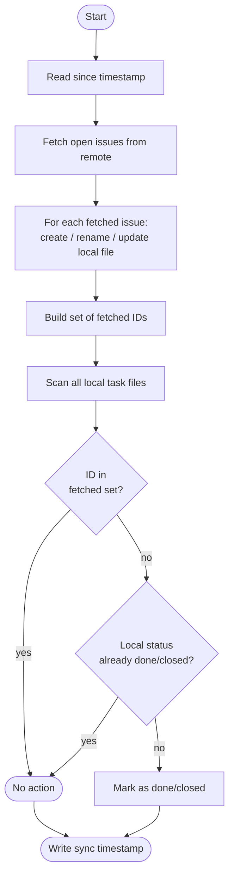

# sync

Pulls data from configured remote providers and writes it to the local filesystem.

```sh
banco sync                                     # sync all configured providers
banco sync <name>                              # sync a specific provider by name or alias
banco sync <name> --module tasks               # sync only the tasks module
banco sync <name> --module repos               # sync only the repos module
banco sync <name> --pattern "myorg/frontend"   # sync only projects matching regex
```

`--module` and `--pattern` can be combined: `banco sync github --module tasks --pattern "myorg/.*"`.

Sync is non-destructive: it never deletes or overwrites existing files.

## Options

| Option | Description |
| --- | --- |
| `--module <tasks\|repos>` | Limit sync to a single module; skips the other. Useful when you only want to fetch issues without cloning repos, or vice versa. |
| `--pattern <regex>` | Only sync projects whose path (`owner/repo` for GitHub/GitLab) matches this regex. Applied on top of the project list already defined in the provider config. Not applicable to Jira. |

## Incremental sync

After each successful sync, banco writes a timestamp to `.banco/sync-state/<provider>`. On the
next run, only items updated since that timestamp are fetched — making subsequent syncs
significantly faster on large projects.

The first sync (or any sync where the state file is absent) always fetches everything. The state
file is only written on success, so a failed sync will retry the full window on the next run.

## Tasks (issues)

Syncing tasks is a two-phase process: **fetch** then **reconcile**.



**Phase 1 — fetch.** Only open/non-done issues are pulled from the remote. The `since` timestamp
limits the fetch to issues updated since the last sync (first sync fetches everything).

**Phase 2 — reconcile.** After writing the fetched issues, banco scans every local task file. Any
task whose ID was *not* in the fetched set and whose local status is not already done/closed is
marked done/closed — it was completed on the remote and simply disappeared from the open results.

| Situation                              | Action                                                  |
| -------------------------------------- | ------------------------------------------------------- |
| Issue not yet on disk                  | Creates a new file with frontmatter and initial content |
| Issue title changed                    | Renames the file; body content is untouched             |
| Status or labels changed               | Updates frontmatter block; body content is untouched    |
| Issue unchanged                        | Does nothing                                            |
| Local open task absent from remote set | Marks the local file as done/closed                     |

## Repos

| Situation            | Action                         |
| -------------------- | ------------------------------ |
| Repo not yet on disk | Clones via SSH                 |
| Repo already on disk | Runs `git fetch --all --prune` |
